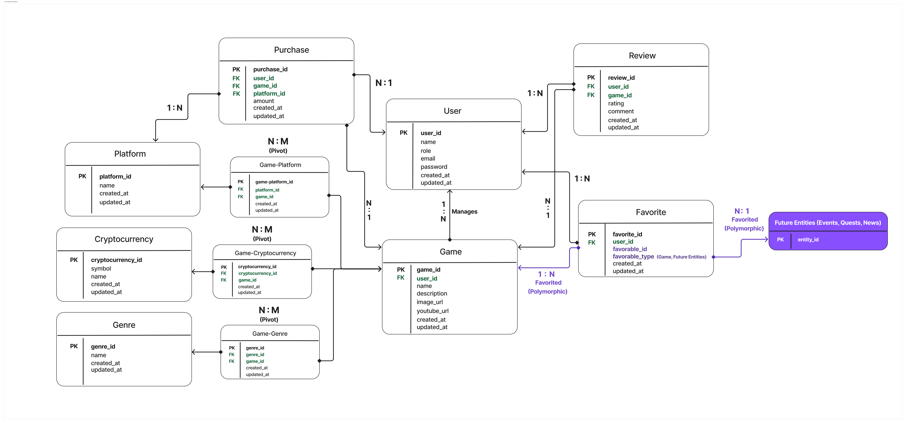

<a id="readme-top"></a>


<br />

<h3 align="center">Crypto Games Store Demo</h3>

  <p align="center">
    <br />
  
  </p>
</div>


## About The Project
A game store backend API built with **Laravel 11**, **MySQL** database, and deployed on **Ngrok** hosting service, featuring authentication, game management, purchases, reviews, and favoriting. It includes role-based access control and a simulated payment gateway integration and supports advanced filtering and sorting and graceful exception handling.

Feature tests are made on a separate MySQL testing database to guarantee the stability on a critical endpoint.

### Built With
[![Laravel][Laravel.com]][Laravel-url]
[![MySQL][MySQL.com]][MySQL-url]
[![Ngrok][ngrok.com]][ngrok-url]
[![Composer][Composer.com]][Composer-url]


### Features
<ul>
<li>Authentication & Role Management - Secure authentication with Role-Based Access Control using Sanctum and custom middleware with rate limiting to prevent brute force attacks.</li>
<li>Performance Optimization - Caching, polymorphic relationships, race condition handling, rate limiting, dependency injection, pagination, and eager loading optimize performance ensuring a smooth experience. </li>
<li>Game Management - CRUD operations for games with support for platforms, genres, and cryptocurrencies</li>
<li>Reviews & Ratings - Users can leave ratings and reviews, with automatic average rating calculations.</li>
<li>Favorites (Polymorphic) - Users can favorite games and easily extend it for other entities.</li>
<li>Payment System - Simulated payment gateway for purchasing games.</li>
<li>Redeem Codes - Unique redeem codes generation & redemption for purchased games with race condition prevention.</li>
<li>Advanced Filtering & Sorting - Search by name, filter by genre/platform, and sort by rating or price.</li>
<li>Automated Testing - Comprehensive Feature tests ensure API reliability on a separate MySQL testing database.</li>
<li>Error Handling - Custom exception handling for many types of errors.</li>
<li>Custom Import Seeding Command - Fetching game data from the Gam3s.gg GraphQL API and seeds the database.</li>
</ul>

### Entity Relationship Diagram




## Installation & Setup

### Dependencies 

Ensure you have the following installed:
<ul>
<li>PHP 8.1+</li>
<li>Composer (Dependency Manager)</li>
<li>MySQL (or any relational database like PostgreSQL)</li>
</ul>

### Installation & Configuration Steps 


1. Clone the repo

   
   ```sh
   git clone https://github.com/GaafarBBK/game-store-demo.git
   ```

2. Navigate to the backend directory and install dependencies
   ```sh
   composer install
   ```

3. Create .env file from the [example template](./.env.example)
   ```sh
   cp .env.example .env
   ```


4. Generate the app key
   ```sh
   php artisan key:generate
   ```

5. Set up the database and run migrations
   ```sh
   php artisan migrate
   ```

6. Run the backend server
   ```sh
   php artisan serve
   ```

7. Importing Games from Gam3s.gg

   
   <I>A custom Artisan command created to import game data from the Gam3s.gg GraphQL API (limit can be adjusted)</i>
   ```sh
   php artisan games:import-from-gam3s --limit=20
   ```

   
### Testing

- **API Testing**: Import the provided [Postman Collection](./Game_Store_Demo.postman_collection.json) to your postman for easy backend testing and validation of API endpoints (contact me to make the server online or change the URL to your local host).
- **Endpoint Testing**: Run the following test to use the feature test I created for updating games:
  ```sh
  php artisan test
  ```


## Contact

<ul>
  <li>Mohamed Gaafar - mohamedgaafar80@gmail.com (+218918709848)</li>
</ul>


[Laravel.com]: https://img.shields.io/badge/Laravel-FF2D20?style=for-the-badge&logo=laravel&logoColor=white
[Laravel-url]: https://laravel.com

[Composer.com]: https://img.shields.io/badge/Composer-885630?style=for-the-badge&logo=Composer&logoColor=white
[Composer-url]: https://getcomposer.org/

[MySQL.com]: https://img.shields.io/badge/MySQL-005C84?style=for-the-badge&logo=mysql&logoColor=white
[MySQL-url]: https://www.mysql.com/

[ngrok.com]: https://img.shields.io/badge/ngrok-140648?style=for-the-badge&logo=Ngrok&logoColor=white
[ngrok-url]: https://ngrok.com/


